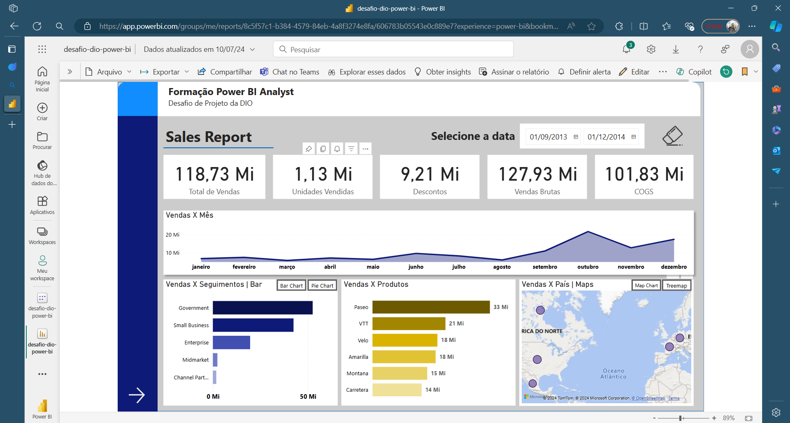

# Criando Um Relatório Gerencial de Vendas com Power BI

## Descrição do Projeto

Este é um dos desafios de projetos da DIO, na formação de Power BI. O projeto envolveu a criação de um relatório detalhado no Power BI Desktop, utilizando a amostra de dados financeiros fornecida pela Microsoft. Este relatório abrange uma gama de visualizações, incluindo:

- Cartões;
- Gráficos de barras clusteriado;
- Gráfico de rosca;
- Gráfico de linhas;
- Gráfico de cascata;
- Árvore hierárquica;
- Mapa;
- Treemaps.

Além disso, foram incorporados visuais adicionais do AppSource, como:
- ChicletSlicer;
- Radar Chart.

## Funcionalidades

O relatório foi projetado com funcionalidades interativas, incluindo:

- Indicadores para a navegação entre páginas;
- Segmentação para seleção de datas;
- Opção para limpeza de filtro;
- Opções para a troca do tipo de visualização dos gráficos.

## Finalização

O término do projeto foi constituido na postagem do relatório no Power BI Service e concluido salvando no repositório do GitHub.

